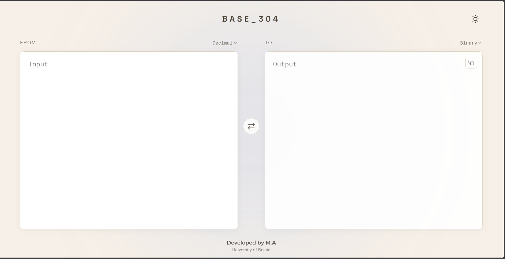
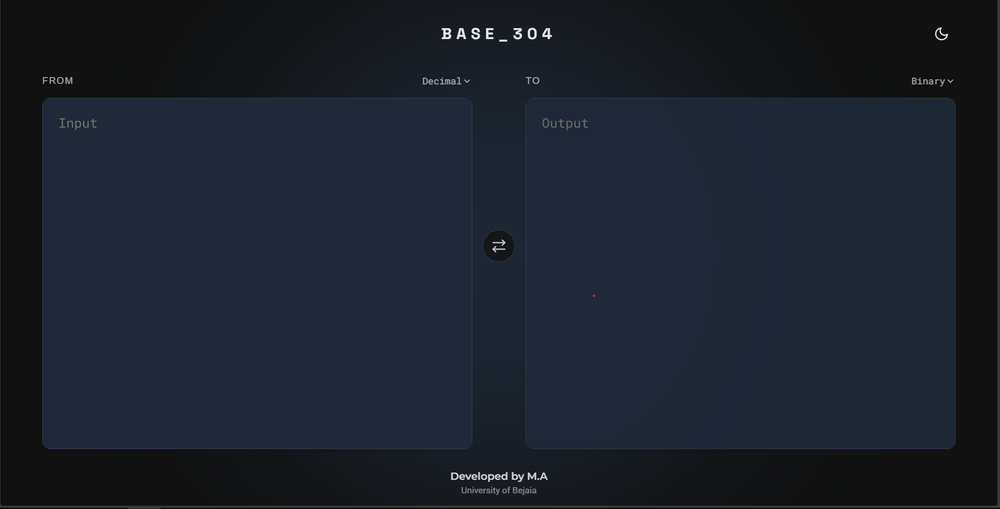
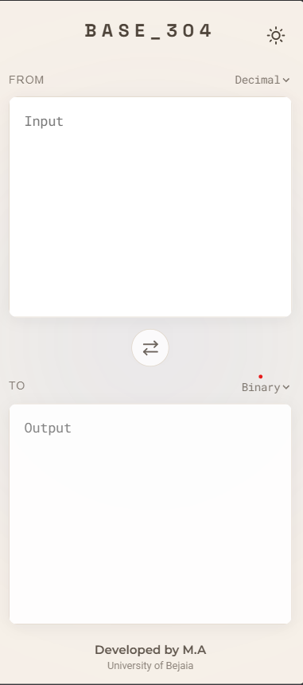
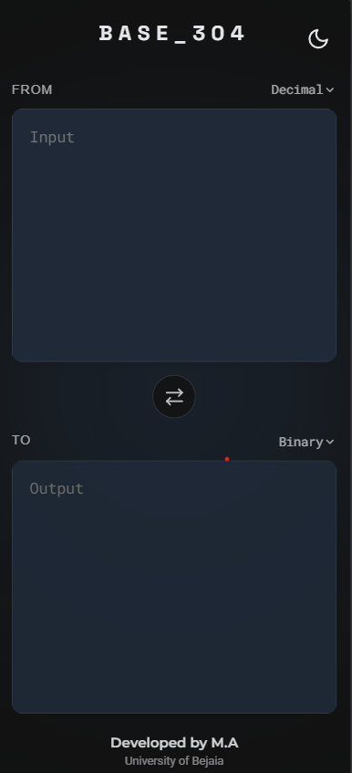

<div align="center">

# 🚀 BASE_304 - The Ultimate Base Converter V 2.0.1

A sleek, modern, and highly functional base converter built with pure Vanilla JavaScript, HTML, and CSS.

This tool provides instant, accurate conversions between a variety of numerical bases and text, wrapped in a beautiful, responsive, and user-friendly interface.

### ➡️ Live Demo ⬅️

https://linuxcoding-adam.github.io/base-converter/


</div>

---

## 📸 Screenshots

### 🖥️ Desktop Version

#### ☀️ Light Theme



#### 🌙 Dark Theme



---

### 📱 Mobile Version

<div align="center">





</div>

---

## 📖 About The Project

**BASE_304** was created to be more than just a utility; it's a demonstration of how powerful modern front-end technologies can be without relying on heavy frameworks.

It handles a wide range of number systems with precision and supports text-to-base conversions, making it a versatile tool for developers, students, and enthusiasts.

### 🎯 Core Goals

#### Accuracy

Handle arbitrarily large numbers without precision loss using JavaScript's powerful `BigInt`.

#### User Experience

Provide a clean, intuitive, and responsive interface that works flawlessly across all devices.

#### Modern Design

Deliver a visually appealing experience with smooth animations, theme switching, and interactive elements.

---

## ✨ Key Features

### 🔢 Multi-Base Conversion

Convert between:

- Binary (Base 2)
- Quaternary (Base 4)
- Octal (Base 8)
- Decimal (Base 10)
- Hexadecimal (Base 16)

### 📝 UTF-8 Text Support

Convert plain text into numerical bases and back, character by character.

### ⚡ Arbitrarily Large Numbers

Powered by JavaScript's `BigInt` for flawless accuracy with very large integers.

### 🔄 Instant Swapping

Swap the **From** and **To** fields instantly with a single click.

### 📱 Responsive Design

Mobile-first layout that adapts perfectly to:

- Desktop
- Tablet
- Mobile

### 🌗 Dual Themes

Includes:

- Elegant Light Mode
- Sleek Dark Mode

Theme preference is automatically saved using `localStorage`.

### 📋 Clipboard Integration

Quickly:

- Copy converted results
- Paste input values

using built-in controls.

### ❤️ Interactive Footer

Animated footer interaction that reveals:

> Made with ❤️ By M.A

on hover or tap.

### 📦 Zero Dependencies

Built entirely with:

- Vanilla JavaScript
- HTML5
- CSS3

No frameworks. No libraries. No bloat.

---

## 🛠️ Technologies Used

### HTML5

Used for the application's structure and semantic content.

### CSS3

Responsible for:

- Layout
- Animations
- Responsive Design
- Custom Properties (CSS Variables)
- Theme Management

### Vanilla JavaScript (ES6+)

Handles:

- Conversion Engine
- DOM Manipulation
- Event Handling
- Theme Persistence
- Clipboard Features

---

## 🚀 Getting Started

### Clone the Repository

```bash
git clone https://github.com/linuxcoding-ADAM/base-converter.git
cd base-converter
```

### Run Locally

Simply open:

```bash
index.html
```

or use:

```bash
python -m http.server
```

---

## 📂 Project Structure

```text
base-converter/
│
├── index.html
├── style.css
├── script.js
├── screenshots/
│   ├── desktop-light.png
│   ├── desktop-dark.png
│   ├── mobile-light.png
│   └── mobile-dark.png
│
└── README.md
```

---

## 🌐 Live Demo

https://linuxcoding-adam.github.io/base-converter/

---

## 🔗 Project Link

https://github.com/linuxcoding-ADAM/base-converter

---

<div align="center">

### Developed by M.A

University of Bejaia

⭐ If you found this project useful, consider giving it a star.

</div>
